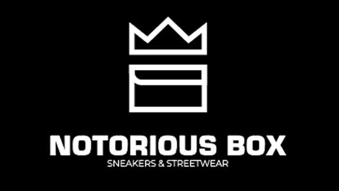

<!--
*** Thanks for checking out the notorious-box. If you have a suggestion
*** that would make this better, please fork the repo and create a pull request
*** or simply open an issue with the tag "enhancement".
*** Thanks again! Now go create something AMAZING! :D
-->

<!-- PROJECT SHIELDS -->
<!--
*** I'm using markdown "reference style" links for readability.
*** Reference links are enclosed in brackets [ ] instead of parentheses ( ).
*** See the bottom of this document for the declaration of the reference variables
*** for contributors-url, forks-url, etc. This is an optional, concise syntax you may use.
*** https://www.markdownguide.org/basic-syntax/#reference-style-links
-->

[![Contributors][contributors-shield]][contributors-url]
[![Forks][forks-shield]][forks-url]
[![Stargazers][stars-shield]][stars-url]
[![Issues][issues-shield]][issues-url]
[![MIT License][license-shield]][license-url]
[![LinkedIn][linkedin-shield]][linkedin-url]

<!-- PROJECT LOGO -->
<br />
<p align="center">
  <a href="https://github.com/camille/notorious-box">
    
  </a>

  <h3 align="center">Market Place Notorious Box</h3>

  <p align="center">
    Programme de la market place de Notorious Box en React Native
    <br />
    <a href="https://github.com/camillevingere/notorious-box"><strong>Explorer la doc »</strong></a>
    <br />
    <br />
    <a href="https://github.com/camillevingere/notorious-box">Voir la démo</a>
    ·
    <a href="https://github.com/camillevingere/notorious-box/issues">Reporter un bug</a>
    ·
    <a href="https://github.com/camillevingere/notorious-box/issues">Reporter une fonctionnalité</a>
  </p>
</p>

<!-- TABLE OF CONTENTS -->
<details open="open">
  <summary>Table des matières</summary>
  <ol>
    <li>
      <a href="#le-projet">Le projet</a>
      <ul>
        <li><a href="#réalisé-avec">Réalisé avec</a></li>
      </ul>
    </li>
    <li>
        <a href="#pour-tester">Pour tester</a>
    </li>
    <li>
      <a href="#pour-commencer">Pour commencer</a>
      <ul>
        <li><a href="#prérequis">Prérequis</a></li>
        <li><a href="#installation">Installation</a></li>
      </ul>
    </li>
    <li><a href="#contact">Contact</a></li>
  </ol>
</details>

<!-- ABOUT THE PROJECT -->

## Le projet

[![Screenshot accueil][product-screenshot]](https://notoriousbox.com)

Cette application est une Market Place permettant à Notorious Box d'étendre son marché.

### Réalisé avec

Ce projet a été réalisé avec les technologies suivantes

- [React Native](https://reactnative.dev/)
- [Expo](https://expo.io/)

## Pour tester

Il faut scanner le QR Code ci-dessous avec l'application "Expo Go" sur Google Play Store (Android) ou l'App store (iOS).

[![Screenshot QR Code][qr-code-expo]](https://expo.io/@camillevingere/NotoriousBox)

<!-- GETTING STARTED -->

## Pour commencer

Il est nécéssaire d'installer quelques librairies avant de pouvoir lancer l'application.

### Prérequis

Vous pouvez les installer comme ceci.

- Installer Node.js via ce lien
  ```sh
  https://nodejs.org/en/download/
  ```
- Pour installer la solution Expo
  ```sh
  sudo npm install -g expo-cli
  ```

### Installation

1. Cloner le dépôt
   ```sh
   git clone https://github.com/camillevingere/notorious-box.git
   ```
2. Allez dans le dossier créé
   ```sh
   cd NotoriousBox
   ```
3. Lancer le projet
   ```sh
   npm start
   ```
   ou
   ```sh
   expo start
   ```
4. Une page internet va s'ouvrir. Cliquer sur "Tunnel" au dessus du QR Code.
5. Scanner le QR Code avec "Expo Go".

<!-- CONTACT -->

## Contact

Camille Vingere - camille.vingere@gmail.com

Lien du projet: [https://github.com/camillevingere/notorious-box](https://github.com/camillevingere/notorious-box)

<!-- MARKDOWN LINKS & IMAGES -->
<!-- https://www.markdownguide.org/basic-syntax/#reference-style-links -->

[contributors-shield]: https://img.shields.io/github/contributors/camillevingere/notorious-box.svg?style=for-the-badge
[contributors-url]: https://github.com/camillevingere/notorious-box/graphs/contributors
[forks-shield]: https://img.shields.io/github/forks/camillevingere/notorious-box.svg?style=for-the-badge
[forks-url]: https://github.com/camillevingere/notorious-box/network/members
[stars-shield]: https://img.shields.io/github/stars/camillevingere/notorious-box.svg?style=for-the-badge
[stars-url]: https://github.com/camillevingere/notorious-box/stargazers
[issues-shield]: https://img.shields.io/github/issues/camillevingere/notorious-box.svg?style=for-the-badge
[issues-url]: https://github.com/camillevingere/notorious-box/issues
[license-shield]: https://img.shields.io/github/license/camillevingere/notorious-box.svg?style=for-the-badge
[license-url]: https://github.com/camillevingere/notorious-box/blob/master/LICENSE.txt
[linkedin-shield]: https://img.shields.io/badge/-LinkedIn-black.svg?style=for-the-badge&logo=linkedin&colorB=555
[linkedin-url]: https://www.linkedin.com/in/camille-vingere/
[product-screenshot]: images/accueil.jpg
[qr-code-expo]: images/qr-code.png
